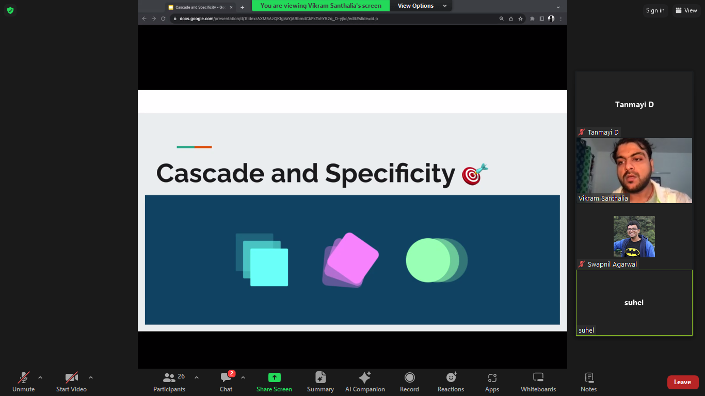

# Cascading and Speficity

### References

- https://estelle.github.io/CSS/selectors/exercises/specificity.html
- https://www.youtube.com/watch?v=c0kfcP_nD9E
- https://stuffandnonsense.co.uk/archives/css_specificity_wars.html

## What is meant by cascade?

- Process of combing different stylesheets and resolivng conflicts between the CSS rules and declarations. THis happens in distinct stages or steps.

example:

```html
<button><></button>
```

```css
button {
  font-size: 20px;
  padding: 10px 20px;
}

.large-btn {
  font-size: 24px;
  padding: 12px 24px;
  background-color: darkgrey;
}
```

Here , .large-btn styles are applied.

## What are the stages of Cascade process? / What factors affects / determines cascade ?

1. Postion or order of appearance
2. Specificity
3. Origin
4. Importance

Specificity

- specificity is an algorithm
- if two selectors target same attribute element
- and there are conflicting styles

- Specificity is the process which resolves which styles need to be applied for an element

- default browser styles are least specific styles
- classes are more specific than element
- ids are more specific than classes

Importance

- !important should not be used in author styles
- Its not valid in css

Example of Transition has higher specifity over !important :

```css
.box {
  height: 100px;
  width: 100px;
  backgroud-color: red;
  transition: all 4s ease;
}

.box: hover {
  height: 400px !important;
  background-color: orange !important;
}
```

- Browers styles are also called user agent styels  
  <--------------------------------------------
  | Important | Origin | Specifity | Position |
  | ------------- | -------------------------- | ------------------ | -------- |
  | Transition | !important browser default | inline |
  | !important | @important user styles | id |
  | animation | !important author styles | class or attribute or pseudo class |
  | normal styles | author styles | type or pseudo element |
  | | user styles |
  | | browser default |

  
  

## Pseudo Classes and Elements difference

## Calculating Specificity

```css
.box {
  height: 100px;
  width: 100px;
  backgroud-color: red;
  transition: all 4s ease;
}

#special-box {
  background-color: maroon;
}

/* (0, 1, 0, 0)  - inline, id, pseudo-class, type or pseudo element */

div {
  background-color: green;
}

/* (0, 0, 0, 1)  - inline, id, pseudo-class, type or pseudo element */

.container #special-box .box {
  background-color: yellow;
}
/* (0, 1, 2, 0)  - inline, id, pseudo-class, type or pseudo element */

#special-box:hover {
  background-color: blueviolet;
}
/* (0, 1, 1, 0)  - inline, id, pseudo-class, type or pseudo element */

#special-box.box:hover {
  background-color: blueviolet;
}
/* (0, 1, 2, 0)  - inline, id, pseudo-class, type or pseudo element */
```

## other example

```html
<div class="box" style="background-color: black"></div>
```

```css
.box {
  height: 100px;
  width: 100px;
  backgroud-color: red !important;
}
```
